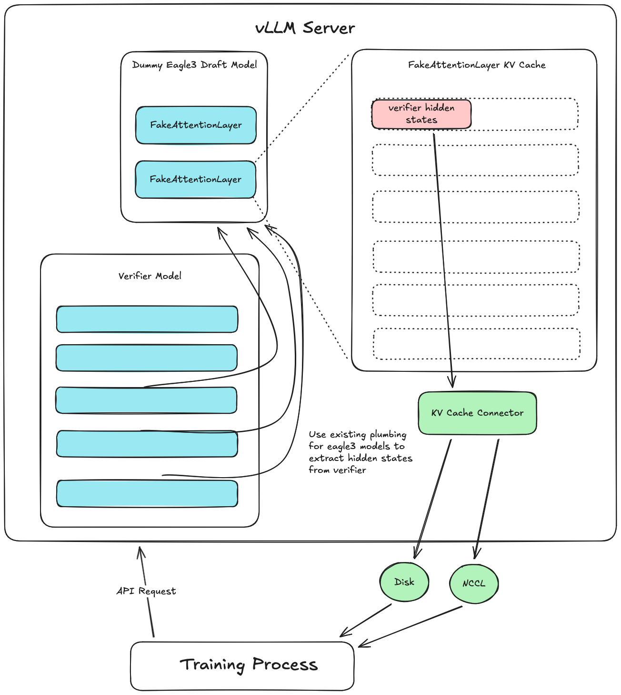
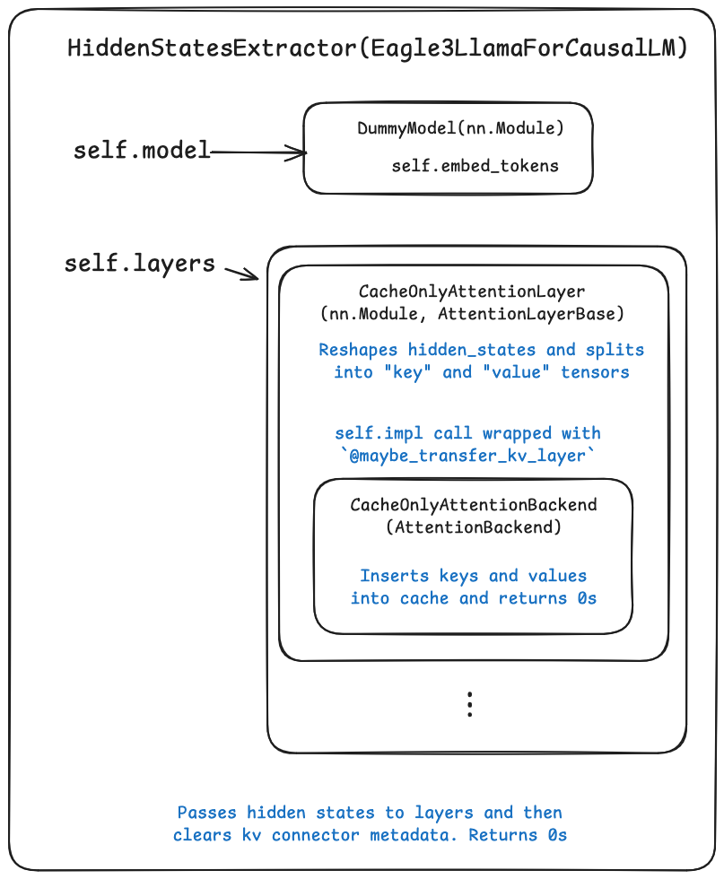

# vllm-hidden-states-extractor
PoC Plugin for extracting hidden states from vLLM.



This plugin works as follows:
- Create a dummy Eagle3 model with `eagle_aux_hidden_state_layer_ids` set to the layers to extract hidden states from.
- Existing vLLM plumbing will pass those hidden states into the dummy model's forward fn.
- The dummy model will cache the hidden states into its layers "KV cache". Its layers are fake "attention" layers that only cache the hidden states and then return garbage.
- A custom KV connector is used to extract hidden states from only the fake "attention" layers and (in for the PoC) save them to disk. 

## Usage
Current usage during experimentation is:

1. Install vllm and this plugin:
```bash
uv pip install -e . 
```
Note: vLLM 0.14.0 is a dependency of the plugin and will be installed automatically.

2. Serve the model with kv connector
```bash
vllm serve ./demo/qwen3_8b --kv-transfer-config '{"kv_connector":"ExampleHiddenStatesConnector","kv_role":"kv_producer","kv_connector_extra_config": {"shared_storage_path": "/tmp/hidden_states"}}'
```

For more information on the model config, see `demo/qwen3_8b/README.md`.

3. Send a request to the model:
```bash
curl http://localhost:8000/v1/completions     -H "Content-Type: application/json"     -d '{
        "model": "./demo/qwen3_8b",
        "prompt": "Why are hidden states required for Eagle3 training?"
    }'
```
4. Verify the hidden states are extracted.
These will be saved to `/tmp/hidden_states/{request_id}/hidden_states.safetensors` (the full filepath is returned in the kv transfer params section of the response). For this PoC
they are stored as a safetensors file with two tensors: 
  - "hidden_states": [num_hidden_states=4, seq_len, hidden_size] 
  - "token_ids": [seq_len]

  Note: the 4 is because we are extracting 4 hidden states.

## Demo

To run a demo with multiple clients, launch the server with kv connector
```bash

vllm serve ./demo/qwen3_8b --kv-transfer-config '{"kv_connector":"ExampleHiddenStatesConnector","kv_role":"kv_producer","kv_connector_extra_config": {"shared_storage_path": "/tmp/hidden_states"}}'
```

and then run

```bash
python demo/multi_client_demo.py --num-clients 3 --server-url http://localhost:8000 --model ./demo/qwen3_8b --num-queries 25
```

This will launch 3 client processes that will each send 25 requests / client to the server (taken the ShareGPT dataset).
In the response from the server, the client will receive the filepath where the hidden states are saved. The client then loads the hidden states and verifies that the shapes match the expected shapes.


## Structure
In `pyproject.toml`, the plugin is registered
```toml
[project.entry-points."vllm.general_plugins"]
register_hidden_states_extractor = "vllm_hidden_states_extractor:register"
```

When vLLM is initialized, it will call the `register` function in `src/vllm_hidden_states_extractor/__init__.py`, which initializes the plugin.

In `src/vllm_hidden_states_extractor/__init__.py`, the `register` function registers the "HiddenStatesExtractor" model and a fake speculator type "extract_hidden_states" (with its handler function) and the "ExampleHiddenStatesConnector" kv connector.

In `src/vllm_hidden_states_extractor/model.py`, the `HiddenStatesExtractor` model is defined. It is intended to be a dummy model that just caches the received hidden states into its layers "KV cache".

In `src/vllm_hidden_states_extractor/attention.py`, the `CacheOnlyAttentionBackend` is defined. It is a custom attention backend that just caches the received hidden states into its layers "KV cache".

In `src/vllm_hidden_states_extractor/model.py`, the `CacheOnlyAttentionLayer` is defined. It is a custom attention layer intended to work with the `CacheOnlyAttentionBackend`. This is partially needed because otherwise FDSP has a check that finds all `Attention` (official vllm attention class) layers and checks that they are using the FSDP backend. Unfortunately, this will fail for our custom attention backend. By creating a custom attention layer that also subclasses `AttentionLayerBase`, we can bypass this check.

In `src/vllm_hidden_states_extractor/connector.py`, the `ExampleHiddenStatesConnector` is defined. It is a simple kv connector that extracts the kv cache for each request (only from CacheOnlyAttentionLayers), reshapes the layers to match the hidden states shape, and saves them to disk. 

